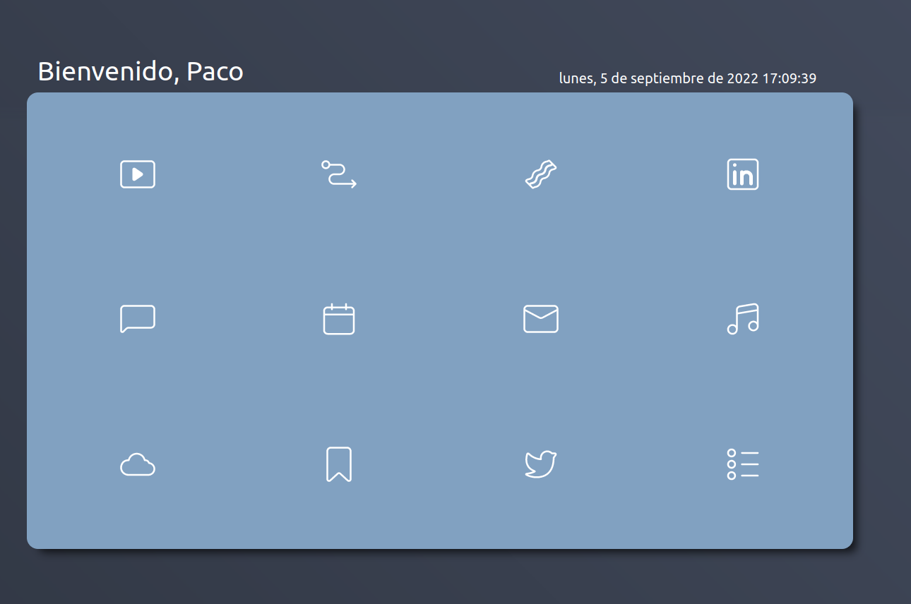

# Custom Start Page
Simple custom start page for your web browser. Just deploy it on git hub pages and add it as your defult new tab link.

## Tecnologies used

* [Node.js](https://nodejs.org/es/) - Framework Used.
* [React](https://reactjs.org/) - UI Library.
* [CircumIcons](https://circumicons.com/) Icons Used.

